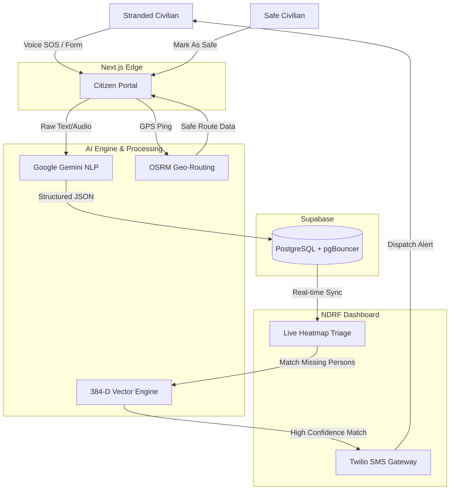

  
  
<b>AI-Powered Disaster Intelligence & Dynamic Triage Engine</b>

  
  

    
    
    
    
    
    
    
  

 

## 🚨 The Problem
During natural disasters (floods, earthquakes), emergency control rooms are overwhelmed with thousands of unstructured, frantic distress calls. Networks throttle, rescue teams deploy blindly without spatial context, and separated families have no centralized way to find each other. **Human guesswork in triage costs lives.**

## 💡 The Solution
**PralayDrishti** is a comprehensive crisis management platform built to survive when everything else fails. It ingests unstructured civilian SOS data, mathematically computes survival windows, and transforms the chaos into prioritized, actionable operational clarity for NDRF rescue forces.

---

## ✨ Key Features

- **🎙️ Multilingual Voice SOS:** Civilians can report emergencies in Hindi, English, or Hinglish via an ultra-low bandwidth portal. The AI auto-transcribes and extracts the hazard.
- **🗺️ Live Hazard Routing:** Maps dynamic OSRM offline routes to the nearest Relief Camps, algorithmically avoiding flooded or dangerous zones.
- **🧠 384-D Semantic Linker:** An AI vector engine that mathematically links separated family members by cross-referencing civilian reports with NDRF recovery logs.
- **📡 Twilio Dispatch Pipeline:** Instant mass SMS broadcasts to civilians and automated dispatch pings to field commanders via Twilio REST APIs.
- **✅ Smart Grid Reduction:** A "Mark As Safe" feature that actively shrinks the rescue search space by removing safe civilians from the active operational grid.
- **⏱️ Dynamic TTC Triage:** Calculates a rigid Time-To-Criticality (TTC) survival window based on the hazard, forcing commanders to focus on the highest-risk casualties first.

---

## 🏗️ System Architecture Pipeline

The data flows from a stranded civilian through the AI engine and directly into the Commander's dashboard in milliseconds.

---

## 🚀 The Tech Stack

### Frontend & UI
- **Next.js 16 (App Router):** Ultra-fast edge routing and API handling.
- **React 19 & Tailwind CSS 4:** Responsive, glassmorphic UI architecture built for military-grade operational clarity.
- **Leaflet & OSRM:** Real-time geospatial mapping and hazard-aware offline routing.

### Backend, Database & Comms
- **Supabase (PostgreSQL):** Resilient database with custom pgBouncer session pooling configuration to handle extreme concurrency.
- **Twilio REST API:** Direct integration for real-time mass SMS broadcasts and rescue unit dispatch notifications.

### AI & Machine Learning
- **Semantic Vector Linker:** Connects public registries to recovery logs bypassing exact keyword matching.
- **Google Gemini:** Transforms frantic, unformatted text into structured JSON logic.

---

## ⚙️ How to Run Locally

### Prerequisites
- Node.js (v18+)
- Twilio API Keys (Set in `.env.local`)
- Supabase Project 

### 1. Boot the Application
\`\`\`bash
# Clone the repository
git clone https://github.com/Aditya6743/PralayDrishti.git
cd PralayDrishti/frontend

# Install dependencies and start the Next.js server
npm install
npm run dev
\`\`\`

### 2. Access the Grid
- 🌐 **Civilian Portal:** [http://localhost:3000](http://localhost:3000)
- 🔒 **Command Center:** [http://localhost:3000/dashboard](http://localhost:3000/dashboard) (Passcode: ELICIT26)
- 🗺️ **Infrastructure Scanner:** [http://localhost:3000/camps](http://localhost:3000/camps)
