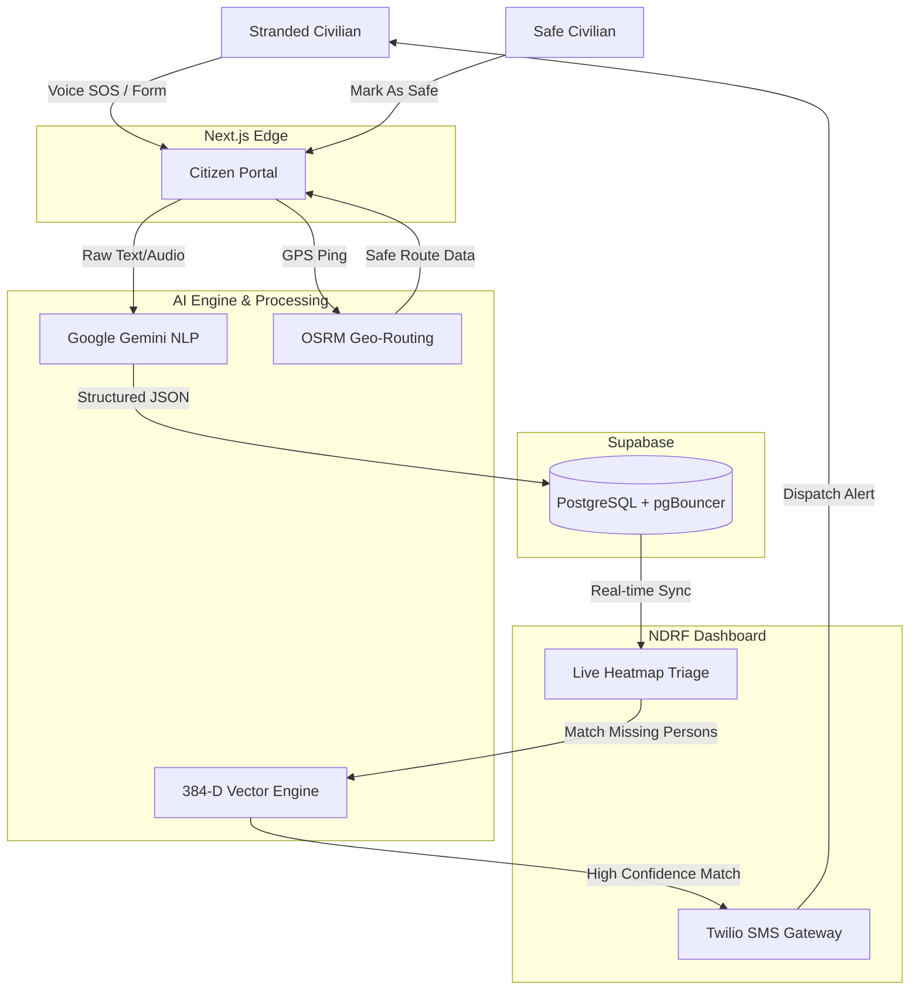

<p align="center">
  
</p>

<p align="center">
  
  
  
  
  
  
  
</p>

# PralayDrishti 🚨

> Turning unstructured disaster chaos into prioritized operational clarity.

**PralayDrishti** is an AI-powered crisis management platform built to survive when everything else fails. It ingests unstructured civilian SOS data, mathematically computes survival windows, and transforms the chaos into actionable operational clarity for NDRF rescue forces.

**Tags:** `Emergency Tech` · `Disaster Response` · `AI Triage` · `Hackathon` · `Next.js` · `Supabase` · `Twilio` · `Gemini AI`

---

## 🚨 The Problem
During natural disasters (floods, earthquakes), emergency control rooms are overwhelmed with thousands of unstructured, frantic distress calls. Networks throttle, rescue teams deploy blindly without spatial context, and separated families have no centralized way to find each other. **Human guesswork in triage costs lives.**

## 💡 The Solution
PralayDrishti eliminates guesswork. The system acts as a smart filter, prioritizing critical casualties based on a dynamically calculated **Time-To-Criticality (TTC)** score, mapping safe infrastructure routes for civilians, and semantically matching missing persons using AI.

---

## 🏗️ System Architecture & Data Flow



---

## 📂 Repository Structure

```
PralayDrishti/
├── frontend/                 # Core Next.js Application
│   ├── src/app/              # API Routes & Next 16 Pages
│   ├── src/components/       # Reusable React UI Components
│   └── src/lib/              # Database Drivers & Utilities
├── backend/                  # Legacy Python FastAPI Services (Data Science/Seeding)
│   ├── app/                  # Python endpoints & models
│   └── api/                  # Core Python business logic
├── docs/                     # Technical Documentation & Presentation Assets
│   ├── FRONTEND_PRD.md       # Frontend Architecture Docs
│   ├── BACKEND_PRD.md        # Backend Architecture Docs
│   ├── presentations/        # PPTX files for judges
│   └── assets/               # Image assets and logos
└── scripts/                  # Diagnostic, DB fixing, and automation scripts
```

---

## ✨ Key Features

- **🎙️ Multilingual Voice SOS:** Civilians report emergencies hands-free. AI auto-transcribes and extracts the hazard.
- **🗺️ Live Hazard Routing:** Maps dynamic OSRM offline routes to nearest Relief Camps, algorithmically avoiding flooded zones.
- **🧠 384-D Semantic Linker:** AI vector engine mathematically links separated family members by cross-referencing reports.
- **📡 Twilio Dispatch Pipeline:** Instant mass SMS broadcasts and dispatch pings to field commanders via Twilio REST APIs.
- **✅ Smart Grid Reduction:** Actively shrinks the rescue search space by removing safe civilians from the active operational grid.
- **⏱️ Dynamic TTC Triage:** Calculates a rigid Time-To-Criticality survival window based on the hazard.

---

## ⚙️ How to Run Locally

### Prerequisites
- Node.js (v18+)
- Twilio API Keys (Set in `frontend/.env.local`)
- Supabase Project 

### 1. Boot the Application
```bash
# Clone the repository
git clone https://github.com/Aditya6743/PralayDrishti.git
cd PralayDrishti/frontend

# Install dependencies and start the Next.js server
npm install
npm run dev
```

### 2. Access the Grid
- 🌐 **Civilian Portal:** [http://localhost:3000](http://localhost:3000)
- 🔒 **Command Center:** [http://localhost:3000/dashboard](http://localhost:3000/dashboard) (Passcode: **ELICIT26**)
- 🗺️ **Infrastructure Scanner:** [http://localhost:3000/camps](http://localhost:3000/camps)
- ✅ **Mark As Safe:** [http://localhost:3000/safe](http://localhost:3000/safe)
